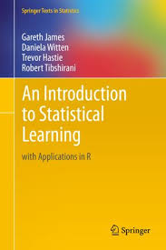

```{r setup, include=FALSE}
knitr::opts_chunk$set(echo = TRUE)
```
## Course objectives

1. Identify the principal tools available in data science.
2. Import your data into R.
3. Visualize distributions of single variables and relations between several variables using ggplot2.
4. Transform and subset your data using tidyverse.
5. Understand what machine learning is and name its principal advantages and challenges.
6. Apply a machine-learning algorithm to test a hypothesis in neuroscience.
7. Harness the power of deep neural networks to quantify behavior with deeplabcut.

## Supplementary materials

1. [R for Data Science](https://r4ds.had.co.nz/)

```{r, echo=FALSE, out.width = "100px"}
knitr::include_graphics("images/rds_cover.png")
```

2. [An Introduction to Statistical Learning: With Applications in R](https://www.academia.edu/36691506/An_Introduction_to_Statistical_Learning_Springer_Texts_in_Statistics_An_Introduction_to_Statistical_Learning). 

```{r, echo=FALSE, out.width="100px"}

```

Both books are available online for free.

## Conventions in the slides

Text appears as this line. 

Computer code appears as the next 3 line
```{r ex, echo=TRUE,eval=FALSE}
x=10
y=5
x+y
```

Comments start with `#`, output starts with `##`
```{r ex1}
# This is a comment, for humans only
x=10
y=5
x+y
```

## Course online repository

The content of the course is in a github repository.

https://github.com/kevin-allen/dataNeuroCourse

We will cover [git](https://git-scm.com/) and online repository later on.

To copy the repository to your computer:
```{bash clone,  eval=FALSE}
git clone https://github.com/kevin-allen/dataNeuroCourse
```
To update your local version, from within your local repository directory
```{bash pull, eval=FALSE}
git pull
```

## Lecture format

1. Short introduction of topics
2. Exercises in small groups
3. Review of exercises
4. Homeworks: readings or some exercise
5. Review quizzes


## Previous experience

Online form (Monday)


## Data science landscape

Create a summary table of what is available (Tuesday)

## Introduction to R 

Perform simple calculation as you would expect.
```{r example1,eval=FALSE}
4+9
(360+50)/2
```

## Variables 
Create an object to store a value using `<-`. You can display the value stored in an object by simply writing its name, or using `print()`.
```{r example2,eval=T}
x<-10+50
x
print(x)
```


## Built-in functions

For a list of function that are part of the core of R see the cheatsheat.
```{r example3}
sin(x)
abs(-100)
seq(1,10)
c(1,2,3,6,7,8)
```

## Object types

There are different types of objects (variables): numerics, characters, factors, logicals, lists, data.frames. 
Inspect with `class()`.
```{r example4}
class(x)
y<-"neuroscience"
class(y)
```

TRICK: You can use tab to complete the name of a fonction in RStudio.


## Data frames

We will be working with data frames.

```{r dataFrame1}
# create a data frame
data.frame(firstName=c("Sonia","Bruno","Paul"),
           height=c(170,188,150),
           weight=c(72,90,50),
           married=c(TRUE,FALSE,FALSE))
```

## Data frames

```{r dataFrame2,echo=FALSE}
data.frame(firstName=c("Sonia","Bruno","Paul"),
           height=c(170,188,150),
           weight=c(72,90,50),
           married=c(TRUE,FALSE,FALSE))
```


1. Data frames are like tables. 
2. A `row` usually represents one observation (e.g., one subject). 
3. A `column` usually contains a variable (e.g., height). 
4. A `cell` containS a single value.

TRICK: Organize your data frame with one entry per row whenever possible. 


## tidyverse

`tidyverse` is a collection of R packages for data science.

Advantages of tidyverse over built-in core R functions

1. Code is easier to understand 
2. Code is easier to read 
3. Easier to learn.

Disadvantage

1. You need to load it before starting coding

## tidyverse

```{r tidy1, results = 'hide'}
library(tidyverse)
```

## A very short introduction to ggplot2

Tuesday

## Exercise with ggplot2

Tuesday

## Data transformation with dplyr

We will now learn how to play with your dataframe.

## Exercise with dplyr

Wednesday
