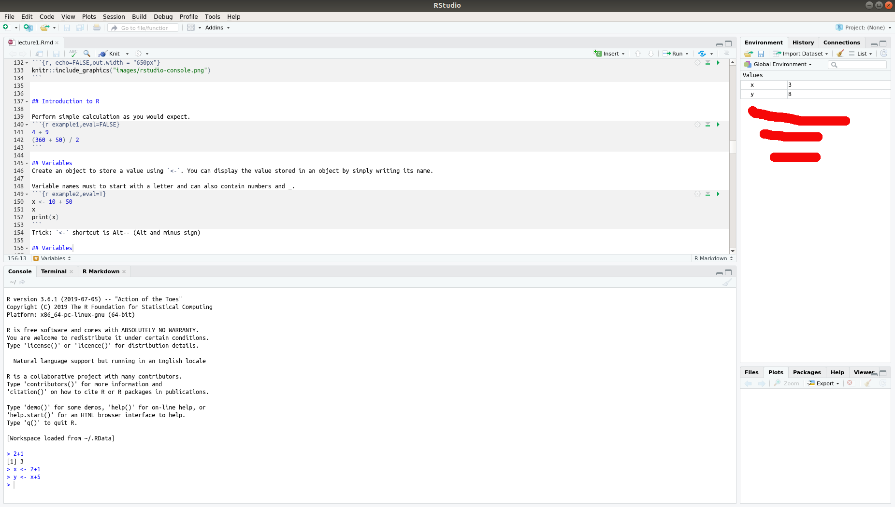

```{r setup, include=FALSE}
knitr::opts_chunk$set(echo = TRUE)
# you might need to install these packages: install.packages()
library(tidyverse)
library(knitr)
```

## Today's plan

1. Overview of the course
2. Assessment of previous experience
3. Data science landscape and RStudio
4. Introduction to R
5. Introduction to ggplot2


## What is data science?

Turn raw data into understanding, insight and knowledge.


```{r, echo=FALSE,out.width = "800px"}
knitr::include_graphics("images/data-science.png")
```

## Course objectives

1. Identify the principal tools available in data science.
2. Import your data into R.
3. Visualize distributions of single variables and relations between several variables using ggplot2.
4. Transform and subset your data using tidyverse.
5. Understand what machine learning is and name its principal advantages and challenges.
6. Apply a machine-learning algorithm to test a hypothesis in neuroscience.
7. Harness the power of deep neural networks to quantify behavior with deeplabcut.

## Supporting materials

1. [R for Data Science](https://r4ds.had.co.nz/)

```{r, echo=FALSE, out.width = "100px"}
knitr::include_graphics("images/rds_cover.png")
```

2. [An Introduction to Statistical Learning: With Applications in R](https://www.academia.edu/36691506/An_Introduction_to_Statistical_Learning_Springer_Texts_in_Statistics_An_Introduction_to_Statistical_Learning). 

```{r, echo=FALSE, out.width="100px"}
knitr::include_graphics("images/isl_cover.jpeg")
```

Both books are available online.

## Conventions in the slides

Code appears as the next 3 line.
```{r ex, echo=TRUE,eval=FALSE}
x <- 10
y <- 5
x + y
```

Comments start with `#`, output starts with `##`.
```{r ex1}
# This is a comment, for humans only
x <- 10
y <- 5
x + y
```


## Course online repository

The content of the course is in a GitHub repository.

https://github.com/kevin-allen/dataNeuroCourse

We will cover [git](https://git-scm.com/) and online repositories later on.

To copy the repository to your computer:
```{bash clone,  eval=FALSE}
git clone https://github.com/kevin-allen/dataNeuroCourse
```
To update your local version, from within your local repository directory
```{bash pull, eval=FALSE}
git pull
```

## Lecture format

1. Short introduction of topics
2. Exercises
3. Review of exercises
4. Homeworks: readings and some exercises
5. Review quizzes

It is your course, interrupt me as often as you like.


## Previous experience

A short survey of the classroom.

https://tinyurl.com/y5m46ghz


## Data science landscape
### Matlab

Stable environment, singal processing, matrix operations
**Weakness**: Proprietary programming language ($)

### Python

Open-source language, very popular, good for signal processing or processing images. 

Excellent for machine learning and deep learning

### R

Open-source language, traditional statistical analysis, visualization, R packages, RStudio

A good entry point to data analysis


## Data science landscape

Recommendations: Use open-source languages (`R` and `python`).

Both `R` and `python` are great tools for data analysis.

In the end, the most crucial point is to get the job done.

We will mainly use `R`. 

Some simple `python` will be used at the very end (`deeplabcut` project).

## RStudio
```{r, echo=FALSE,out.width = "650px"}
knitr::include_graphics("images/rstudio-editor.png")
```

## Tips

* Create a directory called **myNotesDataScience** on your computer.
* Use the code editor if you want to save your code for later use.
* Save your R scripts into your directory. Use one script per lecture (e.g., lecture1.R).
* Send a line of code from editor to R console with `Cmd/Ctrl-Enter`.

## Introduction to R 

Perform simple calculation as you would expect.
```{r example1,eval=FALSE}
4 + 9
(360 + 50) / 2
```

## Variables 
Create an object to store a value using `<-`. You can display the value stored in an object by simply writing its name.

Variable names must to start with a letter and can also contain numbers and _.
```{r example2,eval=T}
x <- 10 + 50
x
print(x)
```
Trick: `<-` shortcut is Alt-- (Alt and minus sign)

## Variables

```{r, echo=FALSE,out.width = "800px"}

```

## Arithmetic operators
```{r arithmetic,echo=FALSE,eval=TRUE}
kable(data.frame(Operator=c("+", "-", "*", "/", "^", "%%", "%/%"),
                 Description=c("Addition","Subtraction","Multiplication","Division",
                               "Exponent","Modulus (Remainder)","Integer division"),
                 Example=c("1+1","5-1","2*5","10/5",
                           "2^3","5%%2","5%/%2"),
                 Results=c(1+1,5-1,2*5,10/5,
                           2^3,5%%2,5%/%2)))
```

## Relational operators

```{r relational,echo=FALSE,eval=TRUE}
kable(data.frame(Operator=c("<", ">", "<=", ">=", "==", "!="),
                 Description=c("Less than","Greater than","Less than or equal","Greater than or equal",
                               "Equal to","Not equal to"),
                 Example=c("1<2","5>4","5<=5","3>=1",
                           "2==2","2!=2"),
                 Results=c(1<2,5>4,5<=5,3>=1,
                           2==2,2!=2)))
```

## Operators and vectors

```{r operatorVector}
x <- 1:5 # vector from 1 to 5
y <- c(2,2,2,2,2) # c for concatenate
x + y
x == y
which(x == y)
```

## Quizz

1. What is the difference between `=` and `==`?

## Built-in functions

```{r example3.1,echo=TRUE,eval=FALSE}
function_name(arg1 = val1, arg2 = val2)
```

```{r example3}
x <- c(1, 2, 3, 6)
sin(x)
seq(1, 10)
sum(x)
```

## Your own functions

Define a function instead of copying and pasting blocks of code.

```{r myFct}
# define a function called addTwo
addTwo <- function(x) {
  return(x + 2)
}
# use the function
addTwo(2)
```

Trick: use tab to complete names

## Your own functions
```{r myFct2}
# definition of a more useful function
fahrenheit_to_celsius <- function(temp_F) {
  temp_C <- (temp_F - 32) * 5 / 9
  return(temp_C)
}
# use it, the name explains what the function does
fahrenheit_to_celsius(32)
```

## Your own functions

```{r myFct3}
# set default values of function parameters
mySum <- function(iOne=1, iTwo = 3){
  return(iOne + iTwo)
}

# use the default parameters
mySum()
```

TRICK: Use tab to complete the name of a function in RStudio.


## Object types

There are different types of objects (variables): numerics, characters, factors, logicals, lists, data.frames. 
Inspect with `class()`.
```{r example4}
x
class(x)
y <- "neuroscience"
class(y)
```


## Data frames

Data are often organized as data frames.

```{r dataFrame1}
# create a data frame
df<-data.frame(firstName=c("Sonia","Bruno","Paul"),
           height=c(170,188,150),
           weight=c(72,90,50),
           married=c(TRUE,FALSE,FALSE))
df
```

Trick: Use `view(df)` to get a more excel-like look.

## Data frames

```{r dataFrame2,echo=FALSE}
df
```

1. Data frames are like tables. 
2. A `row` usually represents one observation (e.g., one subject). 
3. A `column` often contains a variable (e.g., height). 
4. A `cell` contains a single value.

## Data frames

In this course, we will be working mainly with data frames.

TRICK: Organize your data frame with one entry per row whenever possible. 

## Subsetting data frames

This is the traditional `R` way.

```{r dataFrame3}
# one variable
df$height
# or
df[,"height"]
```

## Subsetting data frames
```{r dataFrame4}
# one row
df[1,]
# two rows
df[c(1,2),]
```

## Subsetting data frames
```{r dataFrame5}
df[df$height>165,]
df[df$weight<80,]
```

What does `df[df$married==TRUE]` do? Is it what you expected?

## Get help

1. A google search: what you want to do + `R` 
2. ?function()
3. Ask someone
4. [Cheat sheets](https://rstudio.com/resources/cheatsheets/)


## R packages

Many useful functions are found in R packages. These are free libraries of functions.

To download and install a package from CRAN (Comprehensive R Archive Network).
```{r install, eval = FALSE}
install.packages("package_name")
```

To load the package in your R session
```{r install1, eval = FALSE}
library("package_name")
```

## Exercise

We will use the mpg data set that comes with tidyverse, so load tidyverse.
You can get information with `?mpg`.

1. What is the mean city miles per gallon of all cars?
2. What is the maximum number of cylinders in the data set?
3. What is the range of the highway miles per gallon in the data? 
4. What is the mean city miles per gallon for the first 20 cars?
5. What is the mean city miles per gallon for vehicles produced in 2008?

## Solutions
```{r solution,echo=T,eval=F}
mean(mpg$cty)
max(mpg$cyl)
range(mpg$hwy)
mean(mpg$cty[1:10])
mean(mpg$cty[mpg$year==2008])
```


## To do before the next lecture

1. Install [git](https://git-scm.com/) on your computer.
2. Reading: R for Data Science, Chapters 1 and 2.


## Next lecture

1. Review exercises (15 minutes)
2. RStudio editor and .R files. (10 minutes)
3. git repositories (15 minutes)
4. Introduction to ggplot2 (30 minutes)
5. Introduction to dplyr (30 minutes)
6. Example: Analysis of behavioral data (30 minutes)
