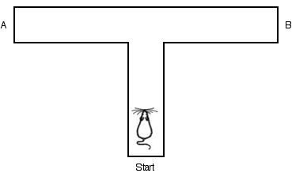
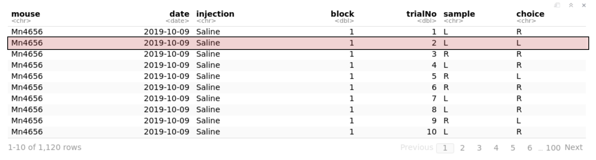
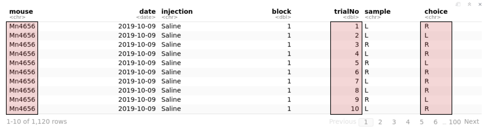
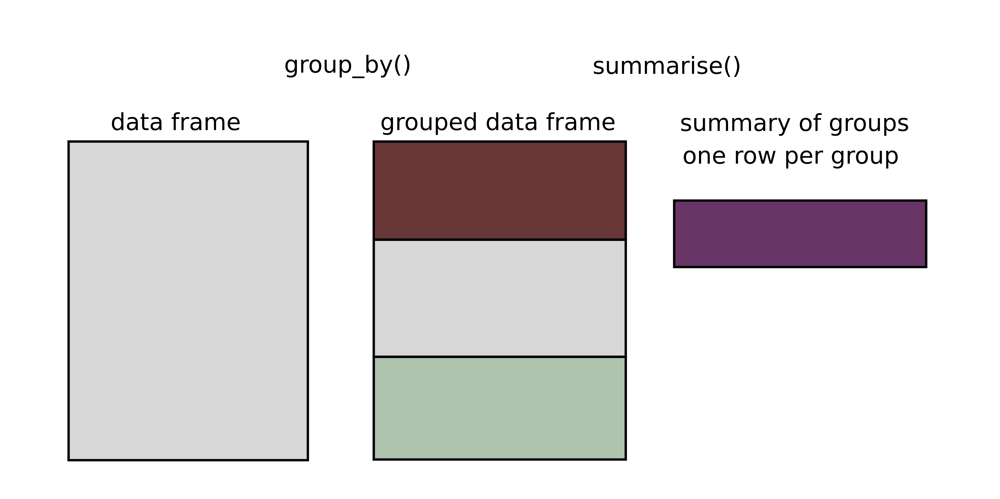

```{r setup, include=FALSE}
knitr::opts_chunk$set(echo = TRUE)
library(tidyverse)
library(knitr)
```


## Today's plan

1. Review exercises
2. RStudio editor and .R files
3. git repositories, part 1
4. ggplot2
5. Get behavioral data into R
6. dplyr
7. Exercises: dplyr and ggplot2

## Reactivation exercises

1. What is the difference between `x = 5` and `x == 5`?
2. `y = "moon"`, what type of object is `y`? What are the other types?
3. How can I find out what type an object is?
4. What is a data frame?
5. How do I get information regarding the use of a built-in function (e.g., `mean`)?

## Should I use `=` or `<-` for assignment?

The difference is very subtle (operator precedence, etc.).

Google and Hadley Wickham (R guru) both say you should use `<-`.

## RStudio editor

A place write code that you may want to keep.

Save code into a .R file for later use or sharing.

```{r, echo=FALSE,out.width = "500px"}
knitr::include_graphics("images/rstudio-editor.png")
```

## RStudio editor

1. Open a new R script (File/New File/R script).
2. Execute a single expression: Cmd/Ctrl-Enter
3. Execute the entire script: Cmd/Ctrl-Shift-S

## Today's exercises 

You can provide some feedback here https://forms.gle/WRWTFFPQPRTcFvyL8

or in the chat

## Exercise 1

Create an R script.

Write the code below in the RStudio editor, run the code, and save it as `myFirstProgram.R`.

```{r editor,eval=FALSE}
library(tidyverse)
# a comment
ggplot(data=mpg) +
  geom_point(mapping=aes(x=displ,y=hwy))
```

## R history

See history tab (top-right)

## git

1. Version control system to track changes in files in a directory
2. Works with any programming languages.
3. Takes snapshot of your files at any time
4. Supports cooperative work
5. Local and remote repositories (e.g., GitHub servers) 
6. Revert back to previous version

## git repositories

Why should I even bother?

1. Prevents catastrophes (a real example)
2. Forces you to keep your code organized
3. Facilitates sharing your code
4. Centralizes your code is in one virtual place (e.g., GitHub)

I recommend creating a repository for any projects that involve programming.

## git repositories

An example of a repository: The course repository on GitHub.

https://github.com/kevin-allen/dataNeuroCourse

Live example.


## git integration in RStudio

You can use git from within RStudio if you create a Project.

https://support.rstudio.com/hc/en-us/articles/200532077-Version-Control-with-Git-and-SVN


## git limitations

git does not work that well with files that are not text files.

We will come back to git repositories when you have more code!


## An introduction to ggplot2

1. `ggplot2` is an R package for visualization.
2. It is relatively easy to learn.
3. You get nice looking graphs relatively quickly.
4. It works well with data frames.
5. R also has base graphics, `plot()`

```{r, echo=FALSE,out.width = "600px"}
knitr::include_graphics("images/data-science.png")
```

Figure from "R for Data Science"

## Load the car dataset (mpg)

```{r plot}
library(tidyverse)
print(mpg)
```

## Create a plot
```{r plot05}
ggplot(data=mpg) +
  geom_point(mapping = aes(x = displ, y = hwy))
```

## Template

```{r plot1, eval=FALSE}
ggplot(data=<DATA>) +
  <GEOM_FUNCTION>(mapping = aes(<MAPPINGS>))
```

1. `ggplot` creates an empty graph and coordinate system for the data
2. `geom` functions add layers to the plot
3. `geom` functions need a mapping argument paired with `aes()`

## Aesthetic Mapping

Aesthetics include the x-axis and y-axis, together with size, shape, color of the points.

```{r plot2,out.width=500}
ggplot(data = mpg) +
  geom_point(mapping = aes(x = displ, y = hwy, color = class))
```

Shape and color work better with categorical variables.

## Exercise 2 (ggplot2)

1. What plot could you produce to investigate whether cars are more efficient on the highway or in a city?
2. How could you add information about the displacement of the motor in your graph? 

## Solution

```{r plot3,out.width=500}
ggplot(data = mpg) +
  geom_point(mapping = aes(x = hwy, y = cty, size=displ),
             color = "blue")+
  xlim(5,40) +
  ylim(5,40)
```

Here I set an aesthetic manually, outside of the `mapping = aes()` block.

## Facets

Split your plot into facets

```{r plot4, out.width=500}
ggplot(data = mpg) +
  geom_point(mapping = aes(x = displ, y = hwy)) +
  facet_wrap(~class, nrow = 2)
```

## Geometric objects

* Used to show different types of graphs
* There are up to 30 types of geoms. 
* You can mix geoms.

## Geometric objects

geom_smooth

```{r geom_smooth,out.width=500}
ggplot(data = mpg) +
  geom_smooth(mapping = aes(x = displ, y = hwy))
```

## Geometric objects

geom_smooth

```{r geom_smooth0,out.width=500}
ggplot(data = mpg) +
  geom_smooth(mapping = aes(x = displ, y = hwy, linetype = drv))
```

## Geometric object 

Combining several geoms

```{r geom_smooth1,out.width=400}
ggplot(data = mpg, mapping = aes(x = displ, y = hwy)) +
  geom_point() +
  geom_smooth()
```

## Count and distributions

Categorical variable
```{r count,out.width=500}
ggplot(data = mpg) +
  geom_bar(mapping = aes(x=class))
```

## Count and distribution
Continuous variable
```{r count1,out.width=500}
ggplot(data = mpg) +
  geom_histogram(mapping = aes(x=displ),binwidth = 0.1)
```

## Exercise 3 (Create a boxplot)

1. Produce a boxplot showing the highway consumption for the different classes of cars.

## Solution

```{r boxplot, out.width=500}
ggplot(data = mpg) +
  geom_boxplot(mapping = aes(x=class,y=hwy))
```

## Behavioural data set

1. We trained mice on a spatial memory task called a rewarded alternation task.
2. The t-maze has a start arm and two goal arms (right and left)
3. Each trial has a forced run and choice run. 
4. During the forced run, the animal is forced to go to one goal arm and receive a reward.
5. During the choice run, the animal can choose which goal arm to enter. Only the non-visited arm contains food.


```{r, echo=FALSE,out.width = "400px"}

```

## Download a data set

Download the data set: https://tinyurl.com/r52pxm5
or here: https://github.com/kevin-allen/dataNeuroCourse/tree/master/dataSets

## Exercise 4 (Load the data set in R)

```{r load}
# path to your downloaded file
myFile="~/repo/dataNeuroCourse/dataSets/tmaze.csv" 

df<-read_csv(myFile)
```

## Inspect the data set

```{r load2}
print(df)
View(df)
```

## tidyverse

`tidyverse` is a collection of R packages for data science.

Advantages of tidyverse over built-in core R functions

1. Code is easier to understand 
2. Code is easier to read 
3. Easier to learn

Disadvantage

1. You need tidy data frames (like our t-maze data)

## tidyverse

```{r tidy1, results = 'hide'}
library(tidyverse)
```

## Data transformation with dplyr

1. Pick observations (rows) by their values: `filter()`
2. Reorder the rows: `arrange()`
3. Pick variable (columns) by names: `select()`
4. Create new variables from existing variable: `mutate()`
5. Collapse many values down to a single summary: `summarize()`

## filter()
Pick observations (rows) by their values. It uses logicals (TRUE or FALSE) to select the rows.
```{r filter, results=FALSE}
filter(df, injection=="Saline")
filter(df, mouse=="Mn4656",block==1) # this uses AND, both needs to be true
filter(df, block %in% c(1,2,3))
```

Main idea:
```{r, echo=FALSE,out.width = "800px"}

```

## arrange()
Change the order of rows
```{r arrange,results=FALSE}
arrange(df,trialNo)
arrange(df,desc(trialNo))
```

## select()

It drops all columns that are not mentioned.

```{r select, results=FALSE}
select(df,mouse,sample,choice)
select(df,starts_with("bl"))
select(df,ends_with("e"))
```

Main idea: 
```{r, echo=FALSE,out.width = "800px"}

```

## mutate()
Add a new variable from old ones.

```{r mutate,eval=TRUE,results=FALSE}
mutate(df,correct=sample!=choice)

# This was actually useful! Save the results
df<-mutate(df,correct=sample!=choice)
```

## mutate

Check if we got what we wanted

```{r mutate2}
select(df,sample,choice,correct)
```

## summarize()

Collapse several rows into a single row.

```{r summarize}
summarize(df, performance = mean(correct))
```

## group_by and summarise()

Collapse according to some groups.
```{r, echo=FALSE,out.width = "800px"}

```


## group_by and summarise()
Group by mouse, then get the mean performance.

```{r group_by}
by_df<-group_by(df,mouse)
summarise(by_df,performance= mean(correct))
```
## group_by and summarise()

Group by mouse and block, then count the number of trials.

```{r group_by1}
by_df<-group_by(df,mouse,block)
summarise(by_df,noTrials= n())
```

## group_by and summarise()

Group by mouse and block, count trials and get the mean performance.

```{r group_by2}
by_df<-group_by(df,mouse,block)
summarise(by_df,noTrials = n(), performance= mean(correct))
```


## Exercise 5 (dplyr and ggplot)


* Create a data frame in which you have the performance of single mice on single blocks. Use the Pipe! 

***

```{r ex0 }
df %>% 
  group_by(mouse,block) %>% 
  summarise(performance = mean(correct))
```

## Exercise 6 (dplyr and ggplot)

* Plot a histogram showing the distribution of performance on every block and mouse (mouse1-block1, mouse1-block2, mouseN-blockN). 

***

```{r ex1 }
new_df<-df %>% 
  group_by(mouse,block) %>% 
  summarise(performance = mean(correct))
ggplot (data=new_df) +
  geom_histogram(mapping = aes(x = performance),binwidth=0.01)
```

## Exercise 7 (dplyr and ggplot)

* The first 3 days of training (e.g, blocks) had 20 trials instead of 10. Plot the distribution of performance on every block and mouse, but only for blocks with 10 trials.

***

```{r ex2, fig.width = 6,fig.height=4}
new_df<- df %>% 
  group_by(mouse,block) %>% 
  summarise(nTrials = n(), performance = mean(correct)) %>% 
  filter(nTrials==10)
ggplot (data=new_df) +
  geom_histogram(mapping = aes(x = performance),binwidth=0.01)
```

## Exercise 8 (dplyr and ggplot)

* Make a plot showing the mean performance of all mice on each block. Use geom_line or geom_point.

***

```{r ex3,fig.width = 6,fig.height=4}
df %>% group_by(mouse,block) %>% 
  summarise(performance = mean(correct)) %>% 
  group_by(block) %>% 
  summarise(global_performance = mean(performance)) %>% 
  ggplot()+
  geom_line(mapping=aes(x=block,y=global_performance))
```

## Exercise 9 (dplyr and ggplot)

* Remember the facet_wrap function in ggplot? It can be used to plot several graphs into the same plot 

Use facet_wrap to display the performance of each mouse separately 

***

```{r ex4,fig.width = 6,fig.height=4}
df %>% group_by(mouse,block) %>% 
  summarise(performance = mean(correct)) %>% 
  ggplot()+
  geom_point(mapping=aes(x=block,y=performance))+
  geom_line(mapping=aes(x=block,y=performance))+
  facet_wrap(~mouse)
```


## Next lecture

1. More exercises on dplyr and ggplot with a different data frame
2. Create your own git repository on github
3. Saving your data to a file
4. Dealing with NAs


## For the next lecture

1. Review ggplot and dplyr exercises.
2. Clone the course repository (https://github.com/kevin-allen/dataNeuroCourse)
3. Read chapters 1 to 4  of R for Data Science
4. [Datacamp introduction to data visualization with ggplot2](https://learn.datacamp.com/courses/introduction-to-data-visualization-with-ggplot2)
5. [Datacamp introduction to tidyverse](https://learn.datacamp.com/courses/introduction-to-the-tidyverse)
