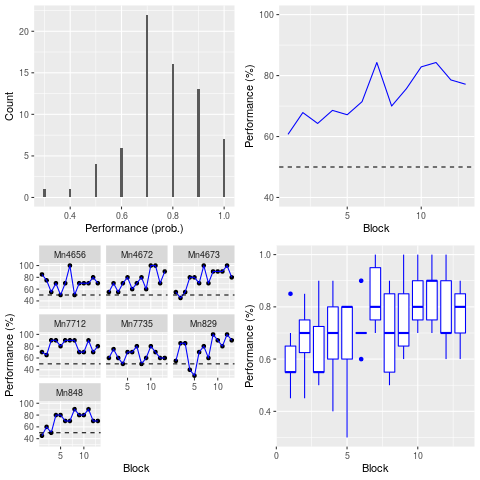
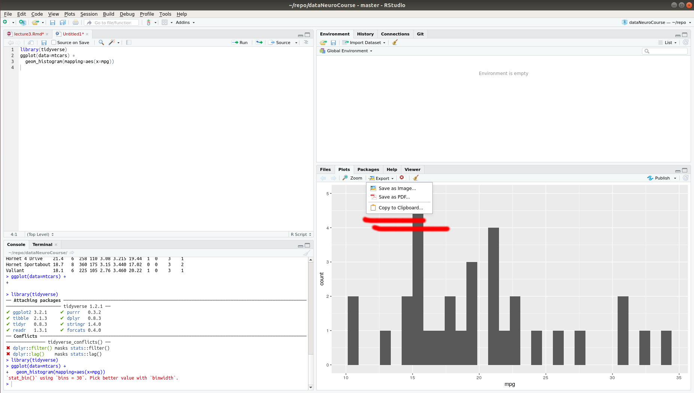

```{r setup, include=FALSE}
knitr::opts_chunk$set(echo = TRUE)
library(tidyverse)
library(knitr)
```


## Today's plan

1. Review of last week
2. Use dplyr and ggplot to do exploratory data analysis
3. Save a plot as a pdf file
4. Create figures with several plots
5. Create your own git repository on GitHub

## Today's objective

```{r, echo=FALSE,out.width = "500px"}

```

## Review: ggplot

```{r review_ggplot}
ggplot(data=mpg) +
  geom_point(mapping = aes(x = displ, y = hwy))
```


## Review: dplyr

1. Pick observations (rows) by their values: `filter()`
2. Reorder the rows: `arrange()`
3. Pick variable (columns) by names: `select()`
4. Create n ew variables from existing variable: `mutate()`
5. Collapse many values down to a single summary: `summarize()`

## Review: load data from a file

```{r review_load}
myFile="~/repo/dataNeuroCourse/dataSets/tmaze.csv" 
df<-read_csv(myFile)
df<-mutate(df, correct = sample != choice)
```

## Review: load data from a file

```{r review_load1}
df
```


## Review: summarise

```{r summarize}
summarise(df, performance = mean(correct))
```

## Review: group_by and summarise

Collapse according to some groups.
```{r, echo=FALSE,out.width = "800px"}
knitr::include_graphics("images/tibble_tmaze_group_by_summarise.png")
```

## Review: group_by and summarise

```{r group_by}
by_df<-group_by(df,mouse)
summarise(by_df,performance= mean(correct))
```

## Using Pipe

Combine multiple operations with the Pipe: ` %>% ` 

` %>% ` is like "then"

`do_thid %>%  do_that %>% do_something_else`


## Using Pipe

```{r pipe,eval=FALSE}
## without Pipe
df_mouse<- filter(df,mouse=="Mn4656")
df_mouse_sel<- select(df_mouse,mouse,block,trialNo,correct)
df_mouse_sel_gb<-group_by(df_mouse_sel,block)
summarise(df_mouse_sel_gb,performance=mean(correct))

## with Pipe
df %>% 
  filter(mouse=="Mn4656") %>% 
  select(mouse,block,trialNo,correct) %>% 
  group_by(block) %>% 
  summarize(performance=mean(correct))
```


## Exploratory data analysis 

It is now time to use our new skills to explore our t-maze data set further.

We will do a series of exercises.

Save your code in a R document with the editor.

Some of it was presented as exercises last week.

## Exploratory data analysis

* Calculate the performance of mice for every combination of mouse and block (mouse1-block1, mouse1-block2, mouseN-blockN). Then plot a histogram showing the distribution of performance. 

* 3 minutes

***

```{r ex1, fig.width = 4,fig.height=3 }
new_df<-df %>% 
  group_by(mouse,block) %>% 
  summarise(performance = mean(correct))

ggplot (data=new_df) +
  geom_histogram(mapping = aes(x = performance),binwidth=0.01)
```


## Exploratory data analysis

* Make a plot showing the mean performance of all mice combined on each block. Use geom_line or geom_point.

* 3 minutes

***

```{r ex100,fig.width = 6,fig.height=4}
df %>% group_by(block) %>% 
  summarise(global_performance = mean(correct)) %>% # mean per block
  ggplot() +
  geom_line(mapping=aes(x=block,y=global_performance))
```

## Exploratory data analysis

Your supervisor is very picky. They want the following changes made to the last graph.

1. The performance should be in percentages instead of probability.
2. The line should be blue. 
3. The x and y labels should be called "Performance (%)" and "Block", respectively.
4. The range of the y axis to go from 40 to 100.
5. A horizontal line should be added at 50 % to indicate chance level.

* 4 minutes

***

```{r ex5,fig.width = 4,fig.height=3}
df %>% group_by(block) %>% 
  summarise(global_performance = mean(correct)*100) %>% 
  ggplot() +
  geom_line(mapping=aes(x=block,y=global_performance),color="blue")+
  ylim(40,100) +
  xlab("Block") +
  ylab("Performance (%)")+
  geom_hline(mapping = aes(yintercept=50),linetype="dashed")
```


## Exploratory data analysis

* Do you think all mice learned equally? It would be great to have a plot per mouse. Each plot shows the performance of a mouse on the different block. Use the facet_wrap function to plot several graphs into the same plot.

* 2 minutes

***

```{r ex4,fig.width = 4,fig.height=3}
# trick, save a dataframe instead of repeating this all the time
df1 <- df %>% group_by(mouse,block) %>% 
  summarise(performance = mean(correct)*100)

ggplot(data=df1) +
  geom_point(mapping=aes(x=block,y=performance)) +
  geom_line(mapping=aes(x=block,y=performance),color = "blue") +
  ylab("Performance (%)") +
  xlab("Block") +
  geom_hline(mapping = aes(yintercept=50),linetype="dashed") +
  facet_wrap(~mouse)
```

## Exploratory data analysis

* It would be great to be able to show the variability in the performance of the different mice without having to show 7  different plots. Can you think of a plot showing the average increase in performance across days and the individual data points of each mouse?

* 4 minutes

***

```{r exp5, fig.width = 5,fig.height=2}
#df1 is the data frame we just created 
df1 %>% 
  ggplot() +
  geom_point(mapping=aes(x=block,y=performance))+
  geom_smooth(mapping=aes(x=block,y=performance)) 
```

Do you see any problems with this plot? Focus on the points...

***

Use some jitter to solve overplotting. This solve the overplotting but is less precise!

```{r exp6, fig.width = 5,fig.height=2}
df1 %>% 
  ggplot() +
  geom_point(mapping=aes(x=block,y=performance),position="jitter")+
  geom_smooth(mapping=aes(x=block,y=performance)) 
```

Most people (myself included) will not like this solution. The block separation is gone.

***

```{r exp7, fig.width = 5,fig.height=2}
df1 %>% 
ggplot( aes(x = factor(block), y = performance)) +
  geom_dotplot(binaxis = "y", stackdir = "center") +
  geom_smooth(mapping=aes(x=block,y=performance))
  

```

Each point now clearly belongs to a block. This is pretty good.

***

```{r exp8, fig.width = 3,fig.height=2}

df1 %>% 
  ggplot() +
  geom_boxplot(mapping=aes(x=block,y=performance,group=block))
```

This is also pretty good.


## Exploratory data analysis

You are now able to use dplyr and ggplot to extract meaningful information from a dataset!!!

Time to share these nice graphs (export).

## Saving a plot

```{r save1, echo=FALSE,out.width = "800px"}

```

## Saving a plot

`ggsave()` saves the latest plot that was displayed

```{r save2,  fig.width = 3,fig.height=2,results=FALSE}
df1 %>% 
  ggplot() +
  geom_boxplot(mapping=aes(x=block,y=performance,group=block))

myFileName="/home/kevin/Downloads/myPlot.pdf"
ggsave(filename = myFileName,
       device = "pdf", units = "cm", 
       width = 10, height = 10)
```


## Figure ith several plots

* Store graphs as variables

```{r sevGraphs1, fig.width = 3,fig.height=2}
p1<- df1 %>% 
  ggplot() +
  geom_boxplot(mapping=aes(x=block,y=performance,group=block),color="blue")+
  ggtitle("Performance per block")
```

```{r sevGraphs2,fig.width = 3,fig.height=2}
p1
```

## Figure ith several plots

Let's store several graphs in variables p1, p2, p3 and p4.

```{r, sevGraphs3}
p1 <- df %>%
  group_by(mouse, block) %>%
  summarise(nTrials = n(), performance = mean(correct)) %>%
  filter(nTrials == 10) %>% 
  ggplot () +
    geom_histogram(mapping = aes(x = performance), binwidth = 0.01) +
    xlab("Performance (prob.)") +
    ylab("Count")
```

***

```{r sevGraphs4}
p2 <- df %>% group_by(mouse,block) %>% 
  summarise(performance = mean(correct)*100) %>%
  group_by(block) %>% 
  summarise(global_performance = mean(performance)) %>% 
  ggplot() +
  geom_line(mapping=aes(x=block,y=global_performance),color="blue")+
  ylim(40,100) +
  xlab("Block") +
  ylab("Performance (%)")+
  geom_hline(mapping = aes(yintercept=50),linetype="dashed")
```

***

```{r sevGraphs5}
p3 <-df %>% group_by(mouse,block) %>% 
  summarise(performance = mean(correct)*100) %>% 
  ggplot() +
    geom_point(mapping=aes(x=block,y=performance)) +
    geom_line(mapping=aes(x=block,y=performance),color = "blue") +
    ylab("Performance (%)") +
    xlab("Block") +
    geom_hline(mapping = aes(yintercept=50),linetype="dashed") +
    facet_wrap(~mouse)
```

***

```{r sevGraphs6}
p4 <- df %>% group_by(mouse,block) %>% 
  summarise(performance = mean(correct)) %>% 
  ggplot() +
  geom_boxplot(mapping=aes(x=block,y=performance*100,group=block),color="blue") +
  ylab("Performance (%)") +
  xlab("Block")
```

***

Now put these graphs together.

```{r sevGraphs7, fig.width = 6,fig.height=4}
#install.packages("gridExtra")
library(gridExtra)
```

***
  
```{r sevGraphs8, fig.width = 6,fig.height=5}
grid.arrange(p1, p2, p3, p4, ncol=2)
```

***
  
Use `pdf()` and `dev.off()` to save your new creation.

```{r sevGraphs9}
myFileName="/home/kevin/Downloads/allMyPlots.pdf"
pdf(file=myFileName,paper = "a4") # open the file
all_ps <- grid.arrange(p1, p2, p3, p4, ncol=2) # write
dev.off() # close the file
```

I usually add the final touch to the graphs using [Inkscape](https://inkscape.org/).


## git: install 

Make sure you save any R script open in RStudio. 

Install git on your computer

* Windows and Mac: (http://git-scm.com/downloads)
* linux: `sudo apt-get install git-core`

Example for Windows : Download for Windows, Run executable, license next,  default location, will install git bash. Use Git and optional Unix tools from the Windows Command Prompt, 3 x next with default

## Set up RStudio

1. Go to Global Options (from the Tools menu)
2. Click Git/SVN
3. Click Enable version control interface for RStudio projects

For more [information](https://support.rstudio.com/hc/en-us/articles/200532077-Version-Control-with-Git-and-SVN)

## Create a repository on GitHub.

1. Create an account at [GitHub](https://github.com/) and verify your email
2. Log in
3. Click New repository
4. Set repository name: myNotesDataScience, set to private, check Initialize this repository with a README
5. Click Create repository

## Create a project with RStudio from your repository

1. Copy the urs of your repository from the github web site. It ends with `.git`
2. Open RStudio, New Project..., Version Control, Git, 
3. Enter the url and set directory.
4. Create project.

## Your first commit and push
1. Click on commit.
2. Make sure `myNotesDataScience.Rproj` is staged.
3. Set commit message to `my first commit`
4. Click commit
5. Click on the up arrow to push your commit to the online repository.
6. Refresh your web browser to see `myNotesDataScience.Rproj` online.

<!-- ## Set up git for your new repository 
  1. Launch git bash.
2. type `cd` and `enter`
3. type `mkdir repo` to create a directory called `repo` in your home directory.
4. `cd repo`
5. `git config --global user.name "Your name"`
6. `git config --global user.email "youremail@hello.com"`
-->
## Next steps with git...

All you will have to do most of the time.

1. Save the file with your R code in your project directory.
2. Stage the file
3. Commit
4. Push

## To do

1. Create your own repository on github containing your code from today.
2. Pull the course repository a few hours before next lecture.

## Next week

1. Combining information from several data frames
2. Common statistical procedures with R
  + Correlation 
  + t-test
  + ANOVA
  + Common assumptions and common errors

  