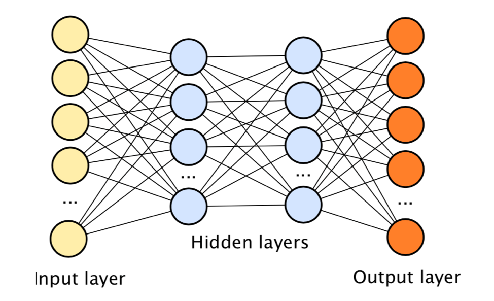
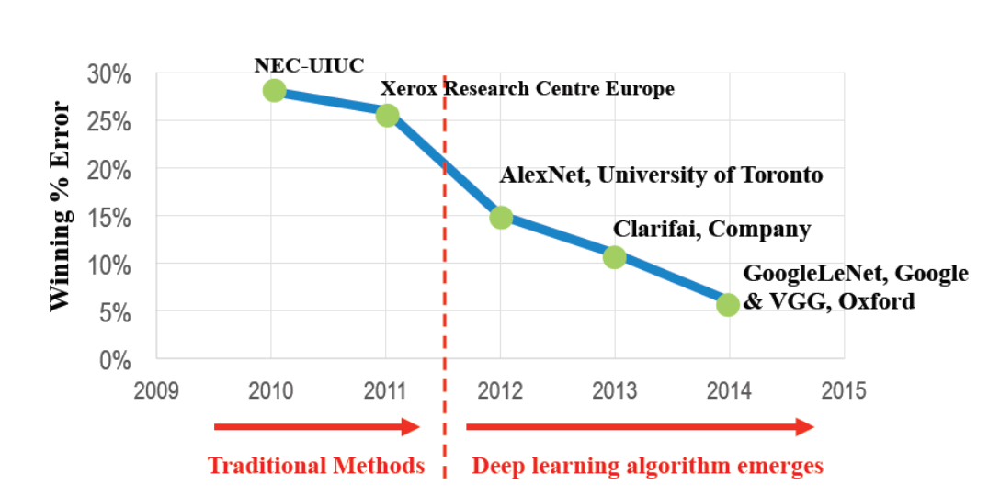
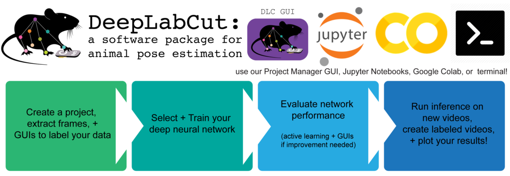
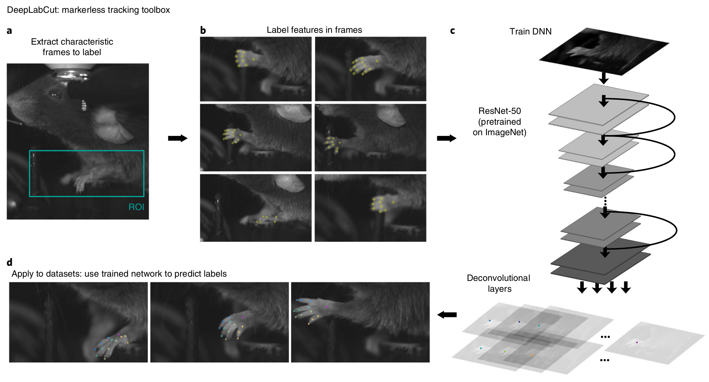
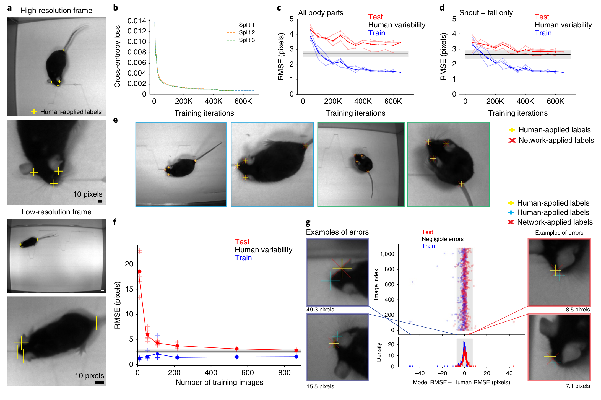

```{r setup, include=FALSE}
knitr::opts_chunk$set(echo = TRUE)
library(tidyverse)
library(knitr)
```

## Machine learning and DeepLabCut

1. Brief review of last lecture
2. Introduction of DeepLabCut
3. Example of how to use DeepLabCut

## Review

Machine learning is the field of study that gives computer the ability to learn without being explicitely programmed.

-- Arthur Samuel, 1959

Examples : A program learns to decide whether an email is spam or not based on training set. 

## Definition of machine learning

* Prediction versus inference
* Supervised versus unsupervised
* Regression versus classification

## Linear regression

```{r load,include=FALSE}
{
myFile="~/repo/dataNeuroCourse/dataSets/tmaze.csv" 
df<-read_csv(myFile)
df<-mutate(df, correct = sample != choice)

df1 <- df %>% 
  group_by(mouse,block) %>% 
  summarise(performance = 100 * mean(correct))
}
```

* One of the simplest model to explain your data.
* $Y = aX + b$
* $Y$: target
* $X$: features (inputs)
* $a$ is the slope and $b$ is the intercept.
* Find the parameters $a$ and $b$ that minimize a cost function.


## Measuring the fit of different models

```{r lm,echo=FALSE,fig.width = 6, fig.height = 3}
dm<-df1
# add a bit of noise to block so that the points are not on top of each other
dm$block<-dm$block + runif(n = length(df1$block), min = -0.5, max = 0.5)
# fit a linear model to the data
fit<-lm(performance~block,data = dm)
# get predicted values and residuals
dm$predicted<-predict(fit)
dm$residuals<-residuals(fit)
# plot 
ggplot(data=dm, mapping = aes(x=block,y=performance))+
  geom_segment(aes(xend = block, yend = predicted),alpha = 0.2) +
  geom_point() +
  geom_smooth(method = "lm", se = FALSE, color = "red")
```

***

```{r best_fit4}
lm(performance~block, data=df1)
```

## Display the results of lm()

```{r compare,fig.width = 3, fig.height = 3}
ggplot(data=df1,mapping=aes(x=block,y=performance)) +
  geom_point(position="jitter") +
  geom_smooth(method = "lm", se = FALSE, color = "red")
```

## DeepLabCut

[https://www.mousemotorlab.org/deeplabcut/](https://www.mousemotorlab.org/deeplabcut/)

## DeepLabCut

* Method for 3D markerless pose estimation
* Quantify behavior
* Uses deep neural networks
* Matches human accuracy, but is much faster
* Used more and more in behavioral experiments
* Open-source technologies (python, tensorflow, etc)

* You need a graphics card (graphics processing unit, GPU).

Previous alternative: video recordings with easily recognizable reflective markers on the animal.


## Deep neural network

```{r, echo=FALSE,out.width = "800px"}

```


## History

* Deep convolutional neural networks became able to detect objects and classify images (ImageNet).

```{r, echo=FALSE,out.width = "800px"}

```

Shawahna, Sait, El-Maleh (2018) IEEEAccess


## DeepLabCut: the workflow


```{r, echo=FALSE,out.width = "800px"}

```


## DeepLabCut: the workflow


```{r, echo=FALSE,out.width = "800px"}

```


## DeepLabCut: performance

```{r, echo=FALSE,out.width = "800px"}

```

## Python and jupyter notebook

We need to use python instead of R to run DeepLabCut.

Have a look at the jupyter notebook called `dlcLaptop.ipynb` in the DeepLabCut directory of the course repository.


If you are new to jupyter notebook, you can install [Anaconda](https://www.anaconda.com/) on your computer. After installation, you should be able to start jupyter notebook on your computer.

The [Jupyter Notebook](https://jupyter.org/) is an open-source web application that allows you to create and share documents that contain live code, equations, visualizations and narrative text.

