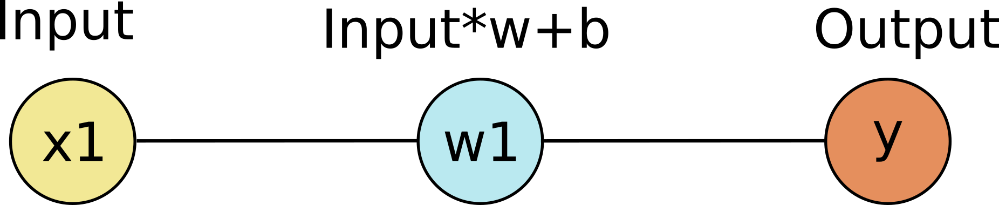
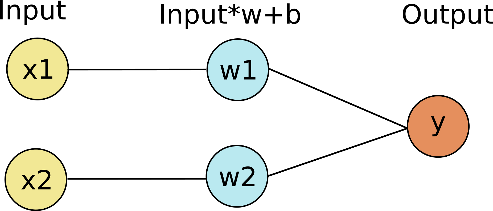
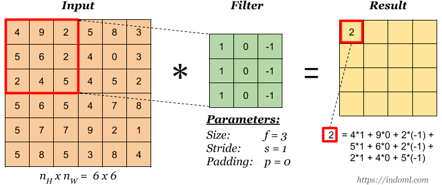
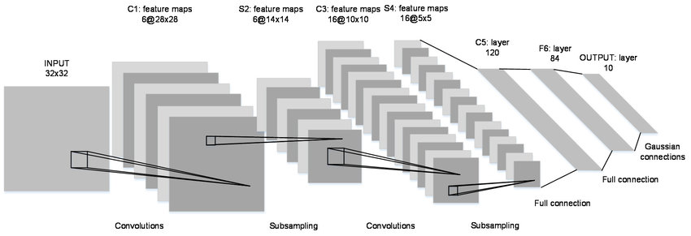
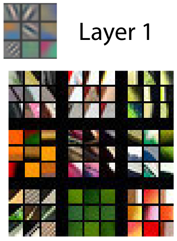
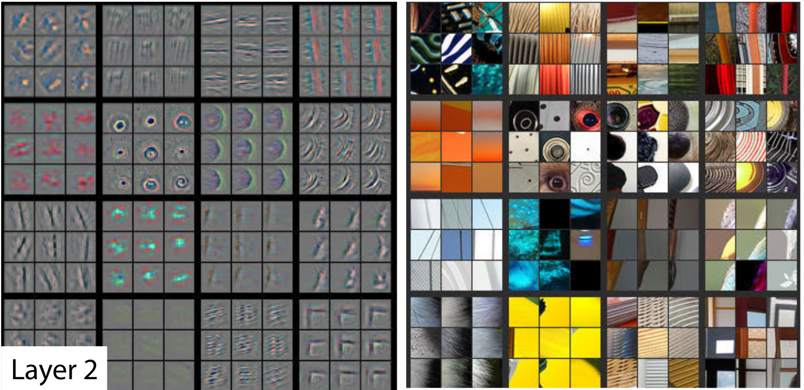
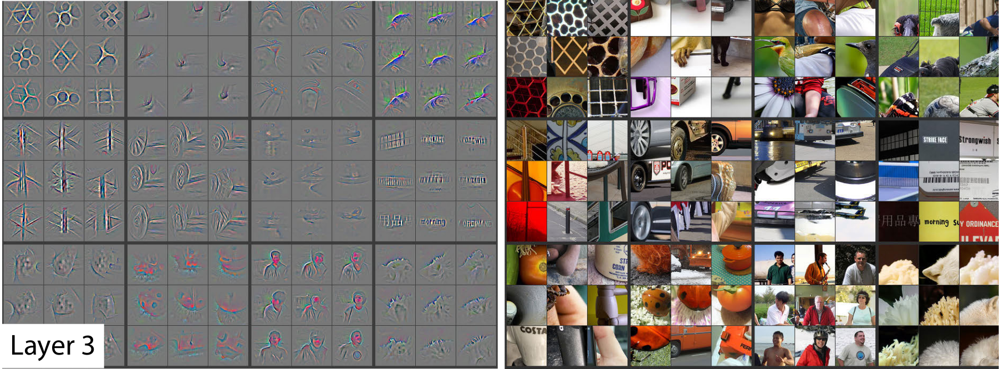
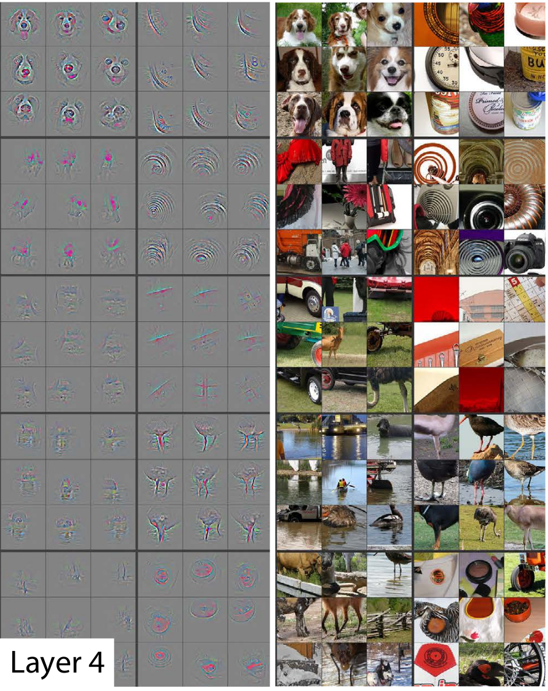

```{r setup, include=FALSE}
knitr::opts_chunk$set(echo = TRUE)
library(tidyverse)
library(knitr)
```

## Machine learning and DeepLabCut

1. Review of key machine learning concepts
2. Introduction to deep neural networks
3. Example of how to use DeepLabCut

## Review

Machine learning is the field of study that gives computer the ability to learn without being explicitely programmed.

-- Arthur Samuel, 1959

## Types of machine learning

* Prediction versus inference
* Supervised versus unsupervised
* Regression versus classification

These concepts are useful to quickly find the right tool (model) for the job.

## How do computers learn?

Often using an iterative process (i.e. a loop).

1. Feed data to your model
2. Calculate the error (loss).
3. Adjust the model parameters by a small amount to minimize the loss, using gradients.
4. Go back to 1.


## Our linear regression model

* One of the simplest models.
* $Y = wX + b$
* $Y$: target
* $X$: features (inputs)
* $w$ is the slope and $b$ is the intercept.
* We found the best parameters ($w$ and $b$) that minimize a loss function.

## Linear regression

```{r, echo=FALSE,out.width = "500px"}

```

## Linear regression

```{r, echo=FALSE,out.width = "500px"}

```

## Deep neural network

Deep neural network have multiple layers between the input and output layers.

```{r, echo=FALSE,out.width = "700px"}
knitr::include_graphics("images/deep-neural-network.png")
```


## Convolutional neural network (CNN)

Date back to 1989 (Yann LeCun). They are great at detecting objects and classifying images.

ImageNet competition: 1.3 million images and 1000 classes

```{r, echo=FALSE,out.width = "700px"}
knitr::include_graphics("images/imageNetResults.png")
```

Shawahna, Sait, El-Maleh (2018) IEEEAccess

## Convolution with images

```{r, echo=FALSE,out.width = "800px"}

```

## Convolutional neural networks

```{r, echo=FALSE,out.width = "800px"}

```
LeCun et al. (1989). Backpropagation applied to handwritten zip code recognition. Neural Computation.

Neurons have receptive fields, similar to what is observed in the visual system.

## Features in convolutional netowrks

```{r, echo=FALSE,out.width = "300px"}

```

Zeiler and Fergus (2013) Visualizing and Understanding Convolutional Networks


## Features in convolutional netowrks

```{r, echo=FALSE,out.width = "700px"}

```

## Features in convolutional netowrks

```{r, echo=FALSE,out.width = "700px"}

```

## Features in convolutional netowrks

```{r, echo=FALSE,out.width = "400px"}

```


## Using a convolutional neural network

DeepLabCut

[https://www.mousemotorlab.org/deeplabcut/](https://www.mousemotorlab.org/deeplabcut/)

## DeepLabCut

* A method for 3D markerless pose estimation
* Uses a deep neural network that was pretrained on image classification
* Matches human accuracy, but is much faster
* Based on open-source technologies (python, tensorflow, etc)
* Training with a graphics card or with online services
* Very popular (>5000 followers on Twitter)

Previous alternative: video recordings with markers on the animal.


## DeepLabCut: the workflow


```{r, echo=FALSE,out.width = "800px"}
knitr::include_graphics("images/dlcOverview.png")
```


## DeepLabCut: the workflow


```{r, echo=FALSE,out.width = "800px"}
knitr::include_graphics("images/MathisFigure1.png")
```


## DeepLabCut: performance

```{r, echo=FALSE,out.width = "800px"}
knitr::include_graphics("images/MathisFigure2.png")
```

## Python and jupyter notebook

We need to use python instead of R to run DeepLabCut.

Have a look at the jupyter notebook called `dlcLaptop.ipynb` in the DeepLabCut directory of the course repository.

If you are new to jupyter notebook, you can install [Anaconda](https://www.anaconda.com/) on your computer. After installation, you should be able to start jupyter notebook on your computer.

The [Jupyter Notebook](https://jupyter.org/) is an open-source web application that allows you to create and share documents that contain live code, equations, visualizations and narrative text.

